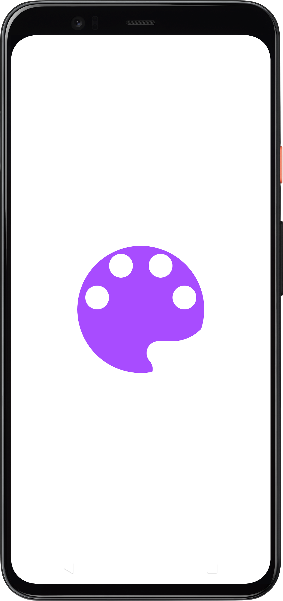
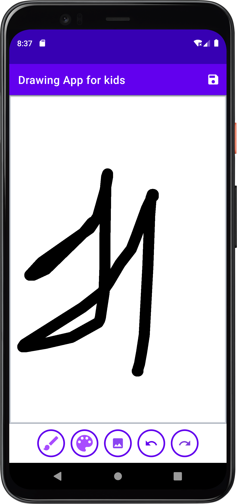
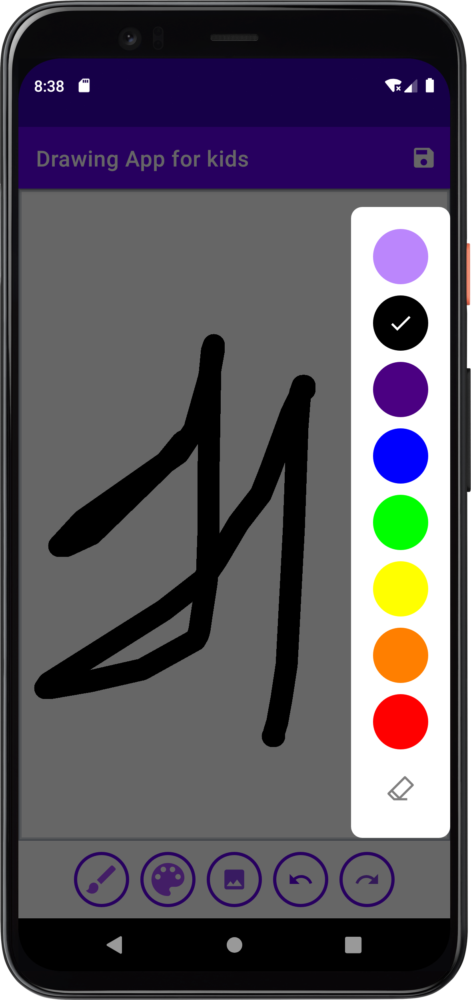
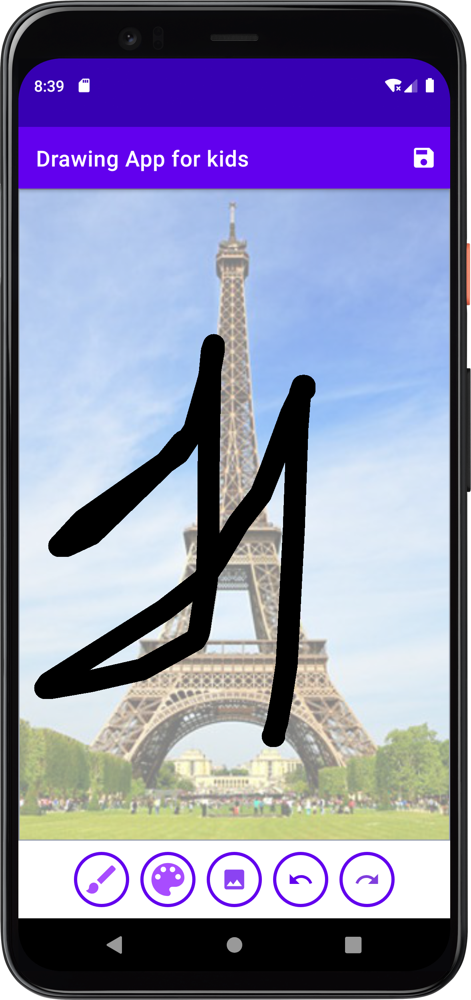
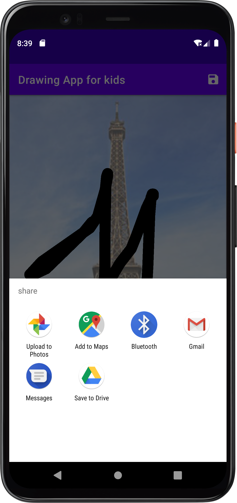

# DrawingApp

#### A drawing App designed for Kids in which we can draw and save the image to our local storage and share it via Social Media Apps. Additionaly we can add a background image from our gallery inorder to trace it out, also there's undo and redo button.

#### Components Used
* Coroutines
* Custom Canvas Component
* Android 12 Splash screen API 
* ActionBar buttons
* Media Scanner Connection: for sharing

 &nbsp;  &nbsp;   &nbsp;   &nbsp; 
